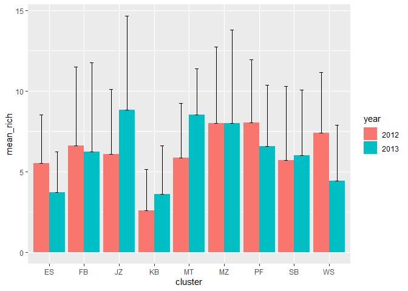
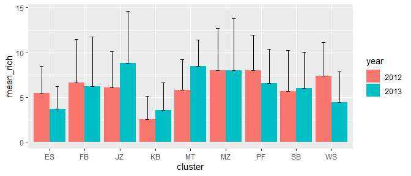

Exploratory daya analysis
================
Dominic Henry
2019-09-19

# The basics

**Some bold text**

*Some italic text*

***Some bold and italic text***

superscript<sup>2</sup>

~~some strikethrough text~~

## Basics header 2

Two spaces to start a new paragraph

### Basics header 3

Or else it will interpret the text as a single line

#### Basics header 4

Insert a horizontal rule

-----

# Code highlighting

The tidyverse has several useful functions such as
`dplyr::filter(dataframe, x < 10)`

# Inline code

The sum of 2 and 2 is 4 and today’s date is **2019-09-19**.

# Hyperlinks

Packages for templates are
[`rmdformats`](https://github.com/juba/rmdformats) and
[`prettydoc`](https://github.com/yixuan/prettydoc).

# Images

Don’t quote directory as string\!


# Setup code chunk defaults

``` r
knitr::opts_chunk$set(
  eval=TRUE,     # Evaluate the code and include its results?
  echo=TRUE,     # Display code along with its results?
  warning=FALSE, # Display warnings?
  message=TRUE,  # Messages?
  error=FALSE,   # Display errors?
  fig.width=7,   # Unit = inches
  fig.width=7    # Unit = inches
)
```

# Example using bird data

``` r
# counts <- readr::read_csv(here("data","bird_counts.csv"))
counts <- readr::read_csv("data/bird_counts.csv")
```

    ## Parsed with column specification:
    ## cols(
    ##   .default = col_double(),
    ##   Site = col_character(),
    ##   Protection = col_character()
    ## )

    ## See spec(...) for full column specifications.

Preview the tibble

    ## # A tibble: 476 x 29
    ##     Year Month Air_temp Wind_speed Site  Protection Cloud_cover Humidity
    ##    <dbl> <dbl>    <dbl>      <dbl> <chr> <chr>            <dbl>    <dbl>
    ##  1  2002     8     62.1        6.7 KZN3~ FP                  55     79.3
    ##  2  2003     4     63.3        6.3 KZN7~ FP                 100     81.8
    ##  3  2002    10     75.2       24.6 KZN4~ FP                 100     80.4
    ##  4  2002    10     88.3        0.2 KZN4~ FP                   0     43.8
    ##  5  2002    12     69.1        0.6 KZN5~ NP                  10     75.1
    ##  6  2002    10     76.1        0   KZN4~ FP                 100     69.8
    ##  7  2002    10     83.3       14.8 KZN4~ FP                  30     63.5
    ##  8  2002     8     70.5       16.1 KZN3~ FP                   5     59.8
    ##  9  2002     8     54.1        4.1 KZN3~ FP                  10     62.8
    ## 10  2002    12     32          0   KZN5~ PP                   0      0  
    ## # ... with 466 more rows, and 21 more variables: abundance <dbl>,
    ## #   richness <dbl>, Latitude <dbl>, Longitude <dbl>, SL_Reeds <dbl>,
    ## #   SL_Grass <dbl>, SL_Shrubs <dbl>, SL_Open <dbl>, AQ_Reeds <dbl>,
    ## #   AQ_FloodGrass <dbl>, AQ_Emerge <dbl>, AQ_Open <dbl>,
    ## #   SL_open_total <dbl>, shore_veg_total <dbl>, AQ_open_total <dbl>,
    ## #   aquatic_veg_total <dbl>, pH <dbl>, DO <dbl>, Temp <dbl>, TDS <dbl>,
    ## #   Sal <dbl>

Using the `kable` function to render neat
tables

``` r
knitr::kable(head(counts))
```

| Year | Month | Air\_temp | Wind\_speed | Site         | Protection | Cloud\_cover | Humidity | abundance | richness |   Latitude | Longitude | SL\_Reeds | SL\_Grass | SL\_Shrubs | SL\_Open | AQ\_Reeds | AQ\_FloodGrass | AQ\_Emerge | AQ\_Open | SL\_open\_total | shore\_veg\_total | AQ\_open\_total | aquatic\_veg\_total |       pH |       DO |    Temp |     TDS |   Sal |
| ---: | ----: | --------: | ----------: | :----------- | :--------- | -----------: | -------: | --------: | -------: | ---------: | --------: | --------: | --------: | ---------: | -------: | --------: | -------------: | ---------: | -------: | --------------: | ----------------: | --------------: | ------------------: | -------: | -------: | ------: | ------: | ----: |
| 2002 |     8 |     62.06 |         6.7 | KZN3\_MZ\_9  | FP         |           55 |     79.3 |       388 |       11 | \-27.66441 |  32.30141 |        10 |        10 |          5 |       75 |         5 |              0 |          0 |       95 |              75 |                25 |              95 |                   5 |       NA |       NA |      NA |      NA |    NA |
| 2003 |     4 |     63.32 |         6.3 | KZN7\_WS\_5  | FP         |          100 |     81.8 |         2 |        1 | \-28.19269 |  32.42087 |         0 |        80 |         20 |        0 |         0 |             15 |          0 |       85 |               0 |               100 |              85 |                  15 | 7.420000 | 7.050000 | 19.2050 | 7793.00 | 9.135 |
| 2002 |    10 |     75.20 |        24.6 | KZN4\_SB\_6  | FP         |          100 |     80.4 |         1 |        1 | \-27.53529 |  32.66017 |         0 |         0 |        100 |        0 |        35 |              0 |          0 |       65 |               0 |               100 |              65 |                  35 | 7.264556 | 5.960000 | 25.6700 |  180.75 | 0.170 |
| 2002 |    10 |     88.34 |         0.2 | KZN4\_PF\_11 | FP         |            0 |     43.8 |         0 |        0 | \-26.87123 |  32.21841 |        90 |         0 |          0 |       10 |        20 |              0 |          0 |       80 |              10 |                90 |              80 |                  20 | 6.822222 | 6.432500 | 26.3025 |   94.00 | 0.090 |
| 2002 |    12 |     69.08 |         0.6 | KZN5\_MT\_1  | NP         |           10 |     75.1 |        16 |        5 | \-28.48856 |  32.16557 |       100 |         0 |          0 |        0 |        40 |              0 |         20 |       40 |               0 |               100 |              40 |                  60 | 7.866667 | 4.653333 | 25.4400 |  555.00 | 0.550 |
| 2002 |    10 |     76.10 |         0.0 | KZN4\_MZ\_9  | FP         |          100 |     69.8 |         6 |        5 | \-27.66441 |  32.30141 |         0 |        10 |         90 |        0 |         0 |              5 |          0 |       95 |               0 |               100 |              85 |                  15 | 7.840556 | 5.805000 | 24.6700 |  284.50 | 0.270 |

Re-order variables and check
names

``` r
counts <- dplyr::select(counts, site,protection,year,month,abundance,richness,
                        everything())
names(counts)
```

    ##  [1] "site"              "protection"        "year"             
    ##  [4] "month"             "abundance"         "richness"         
    ##  [7] "air_temp"          "wind_speed"        "cloud_cover"      
    ## [10] "humidity"          "latitude"          "longitude"        
    ## [13] "sl_reeds"          "sl_grass"          "sl_shrubs"        
    ## [16] "sl_open"           "aq_reeds"          "aq_floodgrass"    
    ## [19] "aq_emerge"         "aq_open"           "sl_open_total"    
    ## [22] "shore_veg_total"   "aq_open_total"     "aquatic_veg_total"
    ## [25] "ph"                "do"                "temp"             
    ## [28] "tds"               "sal"

Remove shoreline and aquatic variables and recheck names

``` r
counts <- dplyr::select(counts, -matches("sl_|aq_"),-humidity)
names(counts)
```

    ##  [1] "site"              "protection"        "year"             
    ##  [4] "month"             "abundance"         "richness"         
    ##  [7] "air_temp"          "wind_speed"        "cloud_cover"      
    ## [10] "latitude"          "longitude"         "shore_veg_total"  
    ## [13] "aquatic_veg_total" "ph"                "do"               
    ## [16] "temp"              "tds"               "sal"

# Data wrangling

``` r
counts <- counts %>% 
  separate(site, c("mission","cluster","site"), sep = "_") %>% 
  arrange(mission, cluster, site) %>% 
  mutate(year = year + 10,air_temp = (air_temp - 32)/1.8) %>% 
  filter(!is.na(ph))
```

| cluster |   Mean |     SD |
| :------ | -----: | -----: |
| ES      |  27.23 |  51.62 |
| FB      | 133.26 | 168.21 |
| JZ      |  73.71 | 125.25 |
| KB      |   8.11 |   8.46 |
| MT      |  33.65 |  45.75 |
| MZ      |  43.10 |  55.38 |
| PF      |  71.12 |  90.13 |
| SB      |  29.88 |  38.43 |
| WS      |  25.23 |  41.86 |

A summary
table

# Species richness plot

<!-- -->

## How did we make that plot?

``` r
# Group, summarise and plot -----------------------------------------------
counts %>% 
  mutate(year = as.factor(year)) %>% 
  group_by(cluster,year) %>% 
  summarise(mean_rich = mean(richness),sd_rich = sd(richness)) %>% 
  ggplot(aes(x = cluster, y = mean_rich, fill = year))+
  geom_bar(stat = "identity",position = position_dodge())+
  geom_errorbar(aes(ymin=mean_rich, ymax=mean_rich + sd_rich),
                width=.2,position=position_dodge(.9))
```

## Small plot 1

<!-- -->

# Equations

In line equations \(Y = X\beta + \epsilon\)

Centered equations
\[Y_{ij} = \beta1_{ij}*temp + \beta2_{ij}*elevation + \epsilon_i\]

[Common statistics
equations](https://gist.github.com/derekmcloughlin/896da22518ef2f3d81b0)

# Shorcuts

These are just a few examples\[1\]

`CTRL + SHIFT + c` to commment out code  
`ALT + SHIFT + i` to insert code chunk  
`CTRL + SHIFT + k` to knit Rmd file

# Remedy package

`{remedy}` provides addins to facilitate writing in markdown with
RStudio.


1.  There are lots more
